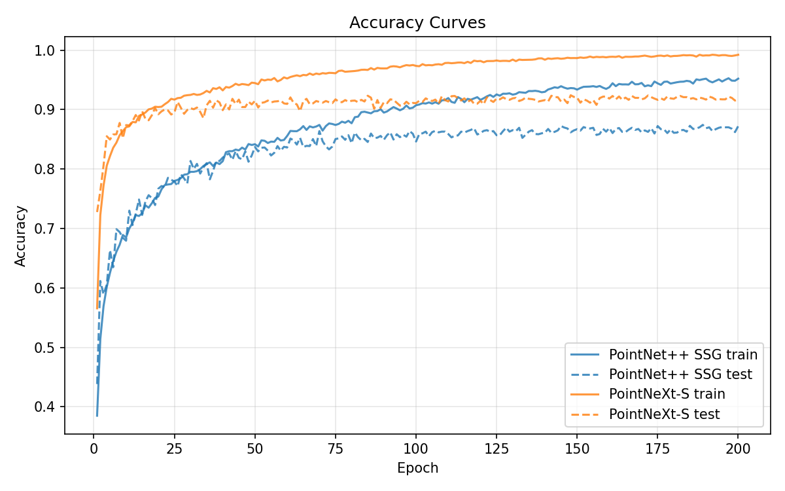
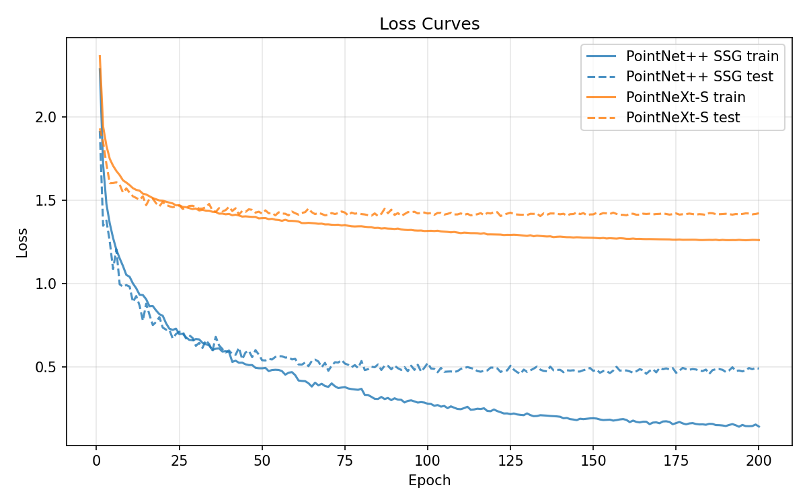

# 几何计算前沿 第三次作业报告

任务: 复现 PointNet++ 和 PointNeXt 在 ModelNet40 上的分类结果

---

## 1. 方法介绍

### 1.1 PointNet++

论文: Qi et al., "PointNet++: Deep Hierarchical Feature Learning on Point Sets in a Metric Space", NeurIPS 2017

PointNet++ 的核心目标是将 CNN 的层次化特征学习范式引入点云处理. 其前作 PointNet 对每个点独立做 MLP + max pooling:

$$f(\{x_i\}) = \max_i \phi(x_i)$$

这一设计虽然天然满足置换不变性, 但完全无法建模局部邻域的几何关系. PointNet++ 的核心改进在于: 在局部 patch 上做 PointNet, 再层次化聚合.

核心流程: 每个 Set Abstraction (SA) 层执行三步操作:

1. Sampling: 使用最远点采样 (FPS) 从 N 个点中均匀选取 M 个中心点, 类似 CNN 中的下采样
2. Grouping: 对每个中心点, 通过 ball query 找到半径 r 内的邻域点 $\mathcal{N}(x_i)$
3. Local PointNet: 对邻域内点应用共享 MLP 并 max-pool 聚合:

$$h_i = \max_{x_j \in \mathcal{N}(x_i)} \phi(x_j - x_i)$$

使用相对坐标而非绝对坐标, 使特征具有平移不变性.

PointNet++ 有 SSG 和 MSG 两种变体. SSG 每个 SA 层使用单一半径; MSG 同时使用多个半径拼接特征, 对采样密度更鲁棒但计算开销显著增加. 本作业复现 SSG 变体 (~1.47M 参数).

架构 (SSG):
```
Input (B, 1024, 3)
  -> SA1: FPS 1024->512, r=0.2, k=32,  MLP [64,64,128]     -> (B, 128, 512)
  -> SA2: FPS 512->128,  r=0.4, k=64, MLP [128,128,256]    -> (B, 256, 128)
  -> SA3: Global, MLP [256,512,1024]                       -> (B, 1024)
  -> FC: 1024->512->256->40 (BN + ReLU + Dropout)
```

### 1.2 PointNeXt

论文: Qian et al., "PointNeXt: Revisiting PointNet++ with Improved Training and Scaling Strategies", NeurIPS 2022

PointNeXt 的核心发现是: PointNet++ 被严重低估了. 作者系统性地研究表明, 许多后续方法声称的架构改进, 其收益实际上来自更现代的训练策略 (更强的数据增强, 更好的优化器, 更长的训练等), 而非架构本身.

PointNeXt 并未推翻 PointNet++ 的核心设计, 而是在其基础上进行了系统性的现代化改造, 主要改进包括:

1. Inverted Residual MLP (InvResMLP)

借鉴 MobileNetV2 / ConvNeXt 的设计思想, 将局部处理分解为空间混合与通道混合两步:

```
features (C)
  -> local aggregation (ball query + MLP + max-pool): C -> C    # 空间混合
  -> pointwise conv: C -> 4C -> C                               # 通道混合
  -> skip connection: output = identity + projected              # 残差连接
  -> ReLU activation
```

残差连接使得深层网络训练更稳定, inverted bottleneck 设计在保持表达能力的同时降低了计算量.

2. 更现代的训练策略

这是 PointNeXt 最大的收益来源之一. 作者对训练 recipe 进行了全面的现代化升级:

| 组件 | PointNet++ (原版) | PointNeXt |
|------|------------------|-----------|
| 优化器 | SGD | AdamW |
| 学习率策略 | StepLR | CosineAnnealing |
| 数据增强 | Z 轴旋转 + jitter | 缩放 + 平移 + jitter (无旋转) |
| Label smoothing | 无 | 0.2 |
| 梯度裁剪 | 无 | grad_norm_clip = 1.0 |
| 训练轮数 | 200 epochs | 200 epochs |

3. 更好的 Scaling 策略

PointNet++ 原版增加深度时容易训练不稳定. PointNeXt 系统研究了宽度, 深度和半径的 scaling 组合, 提供了 S/B/L 等多种配置. 本作业复现 PointNeXt-S 变体.

4. 半径归一化与缩放

PointNeXt 对相对坐标除以 ball query 半径进行归一化 (`normalize_dp=True`), 并在每次下采样后将半径乘以 1.5 倍, 使网络在不同分辨率层级具有一致的相对尺度感知.

架构 (PointNeXt-S):
```
Input (B, 1024, 3)
  -> Stage 0 (stem): Conv1d 3->32                                -> (B, 32, 1024)
  -> Stage 1 (stride=2): SA + InvResx1, 32->64,   r=0.15->0.225  -> (B, 64, 512)
  -> Stage 2 (stride=2): SA + InvResx1, 64->128,  r=0.225->0.338 -> (B, 128, 256)
  -> Stage 3 (stride=2): SA + InvResx1, 128->256, r=0.338->0.506 -> (B, 256, 128)
  -> Stage 4 (stride=2): SA + InvResx1, 256->512, r=0.506->0.759 -> (B, 512, 64)
  -> Stage 5 (stride=1): Global SA, 512->512                    -> (B, 512)
  -> Head: 512->512->256->40
```

---

## 2. 方法对比分析

### 2.1 架构对比

两者本质上是同一条技术路线上的两代系统: PointNeXt 是 PointNet++ 的现代化重新工程化版本, 而非架构革命.

| 特性 | PointNet++ | PointNeXt |
|------|-----------|-----------|
| 核心操作 | MLP + max-pool | MLP + max-pool + 残差 |
| 层次结构 | 3 层 SA | 6 阶段 (stem + 4 层下采样 + global) |
| 残差连接 | 无 | 有 (SA 层 + InvResMLP) |
| 通道混合 | MLP 耦合 | 分离式 (spatial + channel) |
| 半径策略 | 固定 [0.2, 0.4] | 初始 0.15, 逐层 x1.5 |
| 相对坐标 | 不归一化 | 除以半径归一化 |

### 2.2 参数量与速度

在 Apple M 系列 GPU (MPS) 上, batch_size=32, num_points=1024 的基准测试结果:

| 模型 | 参数量 | 前向延迟 | 前+反延迟 | 吞吐量 |
|------|--------|---------|----------|--------|
| PointNet++ SSG | 1.47M | 233 ms | - | 88 samples/s |
| PointNet++ MSG | 1.74M | 3481 ms | - | 6 samples/s |
| PointNeXt-S | 1.38M | 395 ms | - | 53 samples/s |
| PointNeXt-B | 2.04M | 1475 ms | - | 20 samples/s |

分析:
- PointNeXt-S 参数最少 (1.38M), 但比 PointNet++ SSG 略慢, 因为它有更多 FPS + ball query 操作 (6 个阶段 vs 3 层)
- PointNet++ MSG 最慢, 因为多尺度需要在每个 SA 层做 3 次 ball query + MLP
- PointNeXt-B 介于两者之间, 通过 InvResMLP 增加深度而避免了 MSG 的多尺度开销

### 2.3 设计哲学对比

PointNet++ 的设计哲学是 "把 CNN 的层次结构搬到点云上" -- FPS 对应下采样, ball query 对应卷积核, max pooling 对应池化.

PointNeXt 的设计哲学是 "training > architecture". 它揭示了点云领域中一个反复出现的现象: 学术界经常混淆架构改进的收益与训练策略改进的收益. 很多"新模型"的真正优势来自更久的训练, 更大的 batch, 更强的数据增强和更好的优化器, 而非网络结构本身的创新.

这一发现与计算机视觉领域的 "ConvNeXt 对 ResNet", "modernized AlexNet" 等工作一脉相承, 都指向一个方法论上的重要转向: 在评估新架构时, 必须首先对 baseline 进行同等条件的现代化处理.

### 2.4 局限性

两者本质上都属于"局部集合处理"范式, 核心操作始终是 $\text{Set} \to \text{MLP} \to \text{Symmetric Pooling}$. 这意味着:
- 优势: 高效, 工程友好, 泛化性强
- 不足: 几何归纳偏置不够强, 缺乏真正的 message passing 或 attention 机制

因此后续出现了 Point Transformer, KPConv 等方向, 尝试引入更强的几何交互建模.

---

## 3. 复现思路

### 3.1 代码实现

我们从零实现了完整的训练框架, 参考了 openpoints 官方仓库的架构细节:

统一框架:
- `train.py`: 统一训练脚本, 支持多种配置 (SGD/AdamW, StepLR/CosineAnnealing, gradient clipping, label smoothing)
- `data/modelnet40.py`: ModelNet40 数据加载, 支持可配置的数据增强预设
- `benchmark.py`: 模型速度和 FLOPs 基准测试脚本
- `models/pointnet2/`: PointNet++ SSG 和 MSG 实现, 使用 PyTorch 原生算子 (FPS, ball query 均有 Python fallback)
- `models/pointnext/`: PointNeXt-S 和 PointNeXt-B 实现, 严格对齐 openpoints 参考实现

关键实现细节:
- PointNeXt 的 `SetAbstraction` 支持三种模式: stem (Conv1d), 下采样 (FPS + ball query), 全局聚合
- `InvResMLP` 按照 openpoints 的顺序: local_agg -> pwconv -> skip -> ReLU
- 半径在每次下采样后乘以 `radius_scaling=1.5`
- 相对坐标除以半径进行归一化

由于算力限制, 本作业实际训练 PointNet++ SSG 和 PointNeXt-S 两个模型.

### 3.2 训练配置

| 配置 | PointNet++ SSG | PointNeXt-S |
|------|---------------|-------------|
| 优化器 | SGD (0.9) | AdamW |
| 学习率 | 0.01 | 0.001 |
| 调度器 | StepLR (step=20, gamma=0.7) | CosineAnnealing |
| Batch size | 32 | 32 |
| 数据增强 | Z 轴旋转 + jitter + 点 dropout | 缩放 + 平移 + jitter |
| Label smoothing | 0 | 0.2 |
| 梯度裁剪 | 无 | 1.0 |
| 训练轮数 | 200 | 200 |

### 3.3 运行方式

```bash
# 安装依赖
uv sync

# 下载数据集和预训练权重
# 链接: https://disk.pku.edu.cn/link/AA9C79EAF5B21843B48B151F9B24ECBCFA
# 文件夹: pointx-data-ckpt, 解压后将数据集放入 datasets/modelnet40_hdf5_2048/, 权重放入 checkpoints/

# 训练
uv run python train.py configs/pointnet2_ssg.yaml
uv run python train.py configs/pointnext_s.yaml

# 测试
uv run python test.py configs/pointnet2_ssg.yaml
uv run python test.py configs/pointnext_s.yaml

# 基准测试
uv run python benchmark.py --device cuda
```

训练过程使用 wandb (离线模式) 记录 Loss 和 Accuracy 曲线.

### 3.4 训练结果

两个模型均在 NVIDIA RTX 4090 上训练 200 epochs, 使用 wandb 记录训练过程.

| 指标 | PointNet++ SSG | PointNeXt-S |
|------|---------------|-------------|
| 参数量 | 1.47M | 1.38M |
| 训练用时 | 3.6h | 4.9h |
| Best test acc | 87.44% | 92.42% |
| Final test acc | 87.24% | 91.82% |
| Final train acc | 95.21% | 99.23% |
| Final train loss | 0.1433 | 1.2608 |
| Final test loss | 0.4905 | 1.4215 |

注: PointNeXt-S 的 loss 数值高于 PointNet++ SSG 是因为使用了 label smoothing=0.2. Label smoothing 将 one-hot 标签软化为均匀分布, 使交叉熵的理论下限从 0 提升到约 0.23, 因此不能直接比较两个模型的 loss 绝对值. 尽管数值更大, label smoothing 起到了正则化作用, 使模型泛化更好 (test acc 92.4% vs 87.4%).

Accuracy 曲线:



Loss 曲线:



从曲线可以观察到:

1. 收敛速度: PointNet++ SSG 收敛更快, ~epoch 23 即达到最终 test acc 的 90%; PointNeXt-S 需要约 60 epochs 才达到同样比例, 但持续提升, 到 200 epoch 时两个模型都已接近收敛
2. 过拟合: PointNet++ SSG 的 train-test acc 差距约 8% (95.2% vs 87.4%), 而 PointNeXt-S 的差距约 7% (99.2% vs 92.4%), 两者过拟合程度相近
3. 最终性能: PointNeXt-S 比 PointNet++ SSG 高出约 5 个百分点, 这主要归功于 InvResMLP 残差结构, AdamW + CosineAnnealing 优化策略, 以及 label smoothing 的正则化效果
4. 与论文差距: 我们的结果低于论文报告值约 2-3 个百分点, 可能原因包括:
   - 训练 epoch 不够 (论文 PointNeXt 用 600 epochs)
   - 缺少 stochastic depth / EMA 等训练技巧
   - 架构实现与原版存在细节差异 (如 SA 层的 MLP 配置, head 结构等)
   - 所有算子 (FPS, ball query) 均使用 PyTorch 原生实现而非 CUDA kernel, 可能影响训练效率
